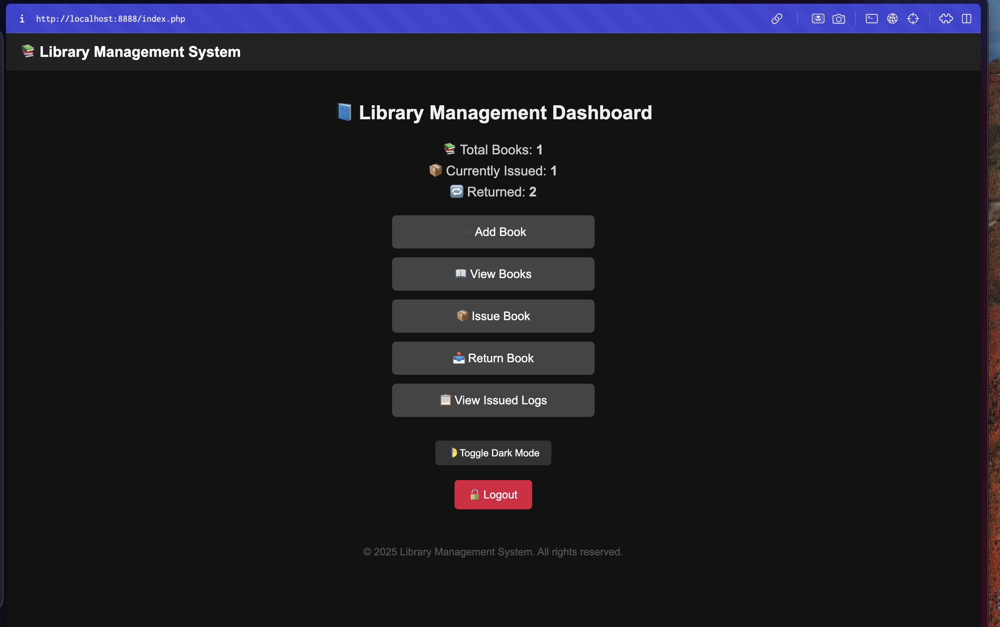

# 📚 Library Management System

A full-stack PHP + MySQL web application to manage book inventory, student borrowing activity, returns, and admin access control. Built as part of an academic portfolio, this project demonstrates real-world CRUD operations, secure login, and session-based workflows in a self-contained library system.

---

## 🔧 Features

- 🔐 Admin login/logout system (session-based)
- ➕ Add new books to the inventory
- 📖 View books with author, genre & date
- 📦 Issue books to students
- 📥 Return books and mark as available
- 📋 View issued logs with real-time status (Issued/Returned)
- 📊 Dashboard with total, issued & returned book stats
- 🌓 Dark mode toggle
- 📱 Mobile responsive layout
- 🚀 Optional deployment using Ngrok

---

## 🛠️ Tech Stack

- **Frontend:** HTML, CSS (vanilla)
- **Backend:** PHP 8.x
- **Database:** MySQL (via phpMyAdmin)
- **Local Server:** MAMP (or XAMPP)
- **Version Control:** Git + GitHub

---

## 📸 Screenshots

> 📌 _Here are a few screenshots to give you a glimpse of the application:_

### Dashboard


---

## 🧪 How to Run Locally

1.  Install [MAMP](https://www.mamp.info) or [XAMPP](https://www.apachefriends.org/index.html)
2.  Clone the repository:
    ```bash
    git clone [https://github.com/rxl895/library-management-system.git](https://github.com/rxl895/library-management-system.git)
    ```
3.  Move the project folder to your MAMP `htdocs` or XAMPP `htdocs` directory.
4.  Start Apache & MySQL from MAMP/XAMPP.
5.  Import the SQL schema from `sql/database.sql` into phpMyAdmin.
6.  Visit: `http://localhost:8888`
    (Login with default credentials: `admin` / `admin123` unless changed.)

### 🛡️ Admin Credentials

**Default:**
```makefile
Username: admin
Password: admin123

